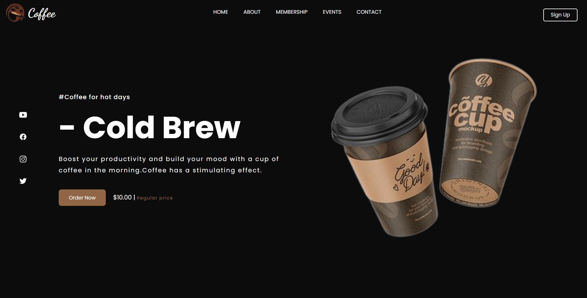

# ☕ Coffee Landing Page

A simple and responsive **Coffee Shop Landing Page** built with **HTML, CSS, and JavaScript**.  
It includes a menu section, navigation bar, and basic interactivity for a clean user experience.  

---

## 📸 Demo / Screenshot

  

---

## 📂 Project Structure

Coffee/
├── .vscode/            # Editor settings (optional)
├── img/                # Images (logo, menu, backgrounds, etc.)
├── index.html          # Main HTML file
├── style.css           # Stylesheet for layout and design
└── srcipt.js           # JavaScript for interactivity

---

## 🛠️ Technologies Used
- **HTML5**  
- **CSS3** (Flexbox, responsive design)  
- **Vanilla JavaScript**  

---

## 🚀 Getting Started

Follow these steps to run the project locally:

1. Clone the repository  

   git clone https://github.com/Rahumansgit/Coffee.git

2. Navigate to the project folder
   
   cd Coffee

4. Open `index.html` in your browser

   * Double click it, OR
   * Use a local server (recommended for best experience, e.g. VSCode **Live Server** extension)

---

## 📖 Usage

* Navbar links take you to sections of the page
* On smaller screens, the hamburger menu toggles navigation
* Menu section highlights coffee items with images and details

---
